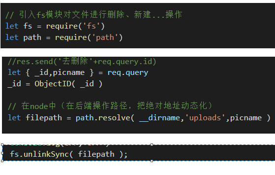
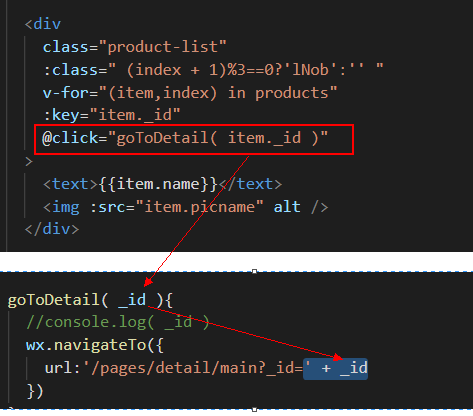
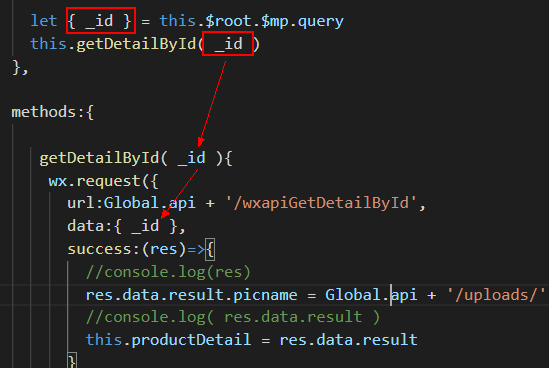
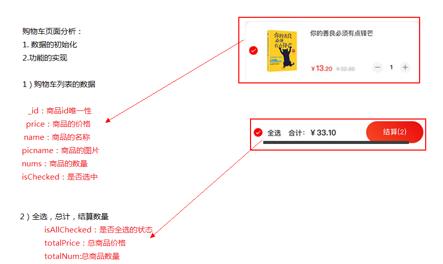
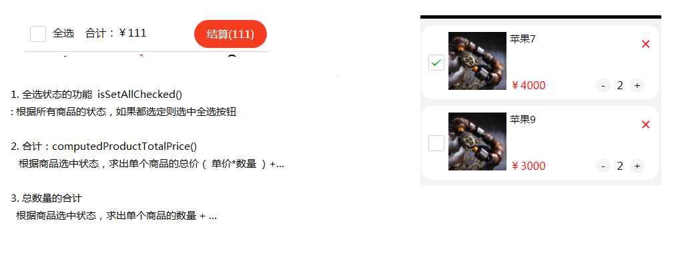

# shopsystem商城管理系统


## 项目管理系统总结

1. 创建项目文件夹
2. npm init -y 生成
3. 安装基本的所需模块
 - express , mongodb , mongoose , mysql
4. 新建app.js入口 新建http服务开启网站端口（api接口）
5. 路由拆分出去（用户根据不同的url请求，匹配到路由，路由的函数代码就是具体的业务逻辑）
    需要一些其它的第3方模块
6. 路由中避免不了操作我们的数据（Model模型）
    M（Model）V（View）C（Controller）


## Mpvue
- 


## 运行说明
- mongod 启动mongodb服务
- npm install | npm i
- node app.js 启动后台系统接口（3000）
- node wxapi.js 启动接口服务（4000）

[配套前台代码](https://github.com/xiaosadewo/708mpvueshop)

## 技术栈
node+express+ejs+mongodb+bootstrap

```
1. 前台页面搭建（前端工程师职责）
2. 后台管理系统【各种各样数据的增删改查】（后端工程师）
    3000
    2.1传统开发（前端把静态页面发送给后端，后端渲染数据）
    2.2单页面应用开发（后端为前端提供接口，前端可以使用vue、react、小程序）
3. 写接口(后端给定也需要自己调试一下postman)
    4000
    3.1 /type => {  }
    后端工程师写路由

    xxapi.com/getTypes=> 一组类别数据
    xxapi.com/getProducts=> 一组商品数据
    xxapi.com/getProduct?id=xxx  得到一条商品详情

    接口返回的一定是json字符串
    不同的公司都有一套api返回规范（但是大同小异）
    最基本的api返回数据
    {
        statusCode:'状态码',
        statusText:'状态描述信息',
        result:'真正需要在页面上展示的数据'
    }

4. 前端工程师渲染页面
    根据后端提供的接口渲染到页面
```

#### 某公司api，返回的json字符串示例
```
{
    "showapi_res_code": 0,
    "showapi_res_error": "",
    "showapi_res_body": {
        "ret_code": "0",
        "remark": "查询成功！",
        "storylist": [
            {
                "classify": "儿童小故事",
                "classifyId": "1"
            },
            {
                "classify": "安徒生童话",
                "classifyId": "2"
            }
            。。。。。。。。。。。。。。
        ]
    }
}
```


## 目录文件说明

- tree /f

```
│  .gitignore git忽略文件
│  app.js 入口文件
│  package.json 项目依赖
│  readme.md 项目说明文件
│
├─static 静态资源文件
├─uploads 上传文件目录
└─views 模板视图目录
```

## 项目功能说明

- 商品的添加|修改|删除|查询
- 商品类别的管理


## 安装所需的基本模块
npm i express ejs mongodb@2 --save

+ ejs@3.0.1
+ express@4.17.1
+ mongodb@2.2.36


## 开启http服务

```
//引入express
let express = require('express')
let app = new express()


//设置ejs模板引擎
app.set('view engine','ejs')


app.get('/',(req,res)=>{
    res.render('index')
})

app.get('/edit',(req,res)=>{
    res.render('edit')
})


app.listen(3000,function(){
    console.log('请在浏览器输入http://localhost:3000 或 http://127.0.0.1:3000')
})
```
## 开启静态资源


```
app.use('/static',express.static('./static'))

<link rel="stylesheet" href="/static/bootstrap/css/bootstrap.css">像视图层引用外部资源的路径统一换成绝对地址
```

## express.Router

### 定义路由并且暴露
```
typeRouter.js

var express = require('express')
var router = express.Router()

router.get('/type/add',()=>{})
router.get('/type/delte',()=>{})

module.exports = router
```
### 引入并使用路由
```
let typeRouter = require('./typeRouter.js')
app.use(typeRouter)
```

## 业务实现

### 类别管理-添加类别（文件上传）

```
类别表：types
名称：name
图片：picname
```

请求地址|请求方法|请求参数|响应结果
---|:--:|:--:|---
/type/add|get|无|type/add.ejs
/type/add|post|名称：name & 图片：picname|true&false

#### multiparty上传文件

> npm i multiparty --save

[mutiparty](https://www.npmjs.com/package/multiparty)
```
照着api抄


var multiparty = require('multiparty');


var form = new multiparty.Form({
    uploadDir:'./uploads'
});

form.parse(req, function(err, fields, files) {
    
    console.log(fields, files);
});

```

#### 数据库操作

```
//引入mongodb包的MongoClient对象
let MongoClient = require('mongodb').MongoClient
const DBURL = 'mongodb://localhost:27017/shopsystem'

//在使用的地址连接数据，得到数据库对象

// 回调加错误优先原则
MongoClient.connect( DBURL,(err,db)=>{

    //对数据库集合进行增、删、改、查

    // insertOne|deleteOne|updateOne|find


    db.close()

} )

```

### 类别管理-渲染类别（查询）

请求地址|请求方法|请求参数|响应结果
---|:--:|:--:|---
/type/index|get|无|type/index.ejs

### 类别管理-删除类别

请求地址|请求方法|请求参数|响应结果
---|:--:|:--:|---
/type/delete|get|id|true&false

>ObjectID说明


#### 文件删除



### 类别管理-编辑

请求地址|请求方法|请求参数|响应结果
---|:--:|:--:|---
/type/edit|get|_id|type/edit.ejs
/type/edit|post|_id & 名称：name & 图片：picname|true&false

## 商品管理-products表名

```

表：就是单独的对象，不要存储不对象不相干的数据
name
price
picname
desc
typeid
```

```
学生信息表：
    _id、姓名、年龄、住址、身份证号、班级号（班级id）
班级表：
    _id、班级名称、班级科目、何时开班、何时毕业、老师工号
教师表：
    。。。
```


### 商品管理-添加

请求地址|请求方法|请求参数|响应结果
---|:--:|:--:|---
/product/add|get|无|product/add.ejs（ 类别的数据 ）
/product/add|post|商品的表单数据|true&false


### 连表查询
[mongodb连表查询](https://www.cnblogs.com/xuliuzai/p/10055535.html)

```
语法：
{
   $lookup:
     {
       from: <collection to join>,
       localField: <field from the input documents>,
       foreignField: <field from the documents of the "from" collection>,
       as: <output array field>
     }
}

*主表和从表*
若同一个数据库中，B表的外键与A表的主键相对应，则A表为主表，B表为从表。

假设学生表（学号，姓名，性别，专业号），专业表（专业号，专业名称），则学生表中的专业号为学生表的外键，其与专业表中“专业号”属性相关联，因此，专业表为主表，学生表为从表。

主键（在某个表中是唯一的不会重复的）和外键（一定会有重复的）。

db.products.aggregate (
	{
		$lookup:{
			from:'types',
			localField:'typeid',
			foreignField:'_id',
			as:'typeInfo'
		}
	}
)
```


## 为前端提供api接口服务

### 类别接口

- /getTypes
- /wxapiGetTypes

```
{
        statusCode:'状态码',
        statusText:'状态描述信息',
        result:'真正需要在页面上展示的数据'
}
 ```

### 商品接口

- /getProducts
- /wxapiGetProducts


## 详情页
- 先不考虑页面跳转
- 页面布局完毕以后先渲染基本的数据
- 在详情页通过请求接口的形式把数据拿到


### 页面之间传参




### 购物车



1. 分析页面数据
2. 页面中定义数据
3. 初始化数据（绑定）
4. 实现总价格
5. 实现总数量
6. 实现全选状态
7. 进入详情页，把数据添加到购物车中（缓存技术）   
如果找到此商品则数量+1，未找到则追加到数组的开头位置
8. 页面与购物车之间切换，当购物车页面显示时（onShow时获取最新的购物车数据缓存）
9. 把购物信息永久的存储在数据库中

```
购物车设计方案
1. 传统方案，无论操作哪一步只要购物车信息的状态改变了，就直接更新数据中的对应用户的购物车信息（缺点：频繁请求服务器器，优点：及时的保存购物车信息）
    1.1 不使用前端框架（后端去做）
    1.2 使用前端框架（后端轻松一点，考验前端的能力）
        1.2.1 只要改变状态同时更新数据库
        1.2.2 改变状态不及时更新数据库（离开这个购物车页面|离开小程序的时候才更新到数据库中）


2. 关于购物车信息和用户绑定（ 了解 ）（反映在用户体验上）
    不登录也能加入购物车，但是最生成订单的时候，肯定有自己的信息和购物车信息绑定起来（生成的订单和自己的信息绑定）


carts集合：
userinfo ->唯一的用户标识
cartList -> 购物车信息


一种优化方案。

真正的购物车信息最后需要放入数据库中，
```


## 总结购物车（ 所有页面中数据的增、删、改、查 ）
1. 先把页面布局出来（结构）
2. 后端如果未给数据
3. 给接口以后，先请求一次，把数据结构拿到以后渲染到页面中
4. 如果是单纯的详情页面（可能只是渲染数据就可以）
5. 像购物车这种页面（里面有很多交互），因为像vue、react、小程序不关心DOM，我们只关心数据就可以。数据更新，页面视图也同时更新
6. 当前端把交互功能完成以后，在合适的时机把数据保存到数据库。

+ 6.1 购物车信息添加的时候（涉及到前端另一层的技术【数据交互】）：后端提供接口，前端使用接口（接口如何使用，后端会给你提供接口文档）
    
+ 6.2 如果用户的购物信息为空，则直接insert【添加】就可以
 
+ 6.3 如果用户的购物信息不为空，则需要使用update
    思路：在请求保存购物车信息接口的时候，能够获取到用户信息。如果在购物车表中查到此用户，则使用update，如果没有查询到此用户信息则使用insert


### 关于post请求
- 默认为x-www-form-urlencoded数据格式，使用body-parser中间件
- form-data请求提交，在node中使用formidable或mutiparty中间件获取
- 注：get默认也为：x-www-form-urlencoded


#### 页面之间的数据共享
- querystring=>  url?querystring 【 只能传递字符串 】
- localStorage(永久) | sessionStorag(浏览器会话结束) 【只能是字符串】
- cookie(存储在本地)【只能是字符串】 | session(服务端)【服务器支持的所有类型】
- vuex【刷新回归初始值|js的数据类型】 redux
- app.js , 模块化, setStorage【所有的数所类型】


## CORS

```
app.all('*',function (req,res,next) {
    res.header("Access-Control-Allow-Credentials", "true");
    res.header("Access-Control-Allow-Headers","Origin, X-Requested-With, Content-Type, Accept");
    res.header("Access-Control-Allow-Origin", '*');
    res.header("Access-Control-Allow-Methods", "PUT,POST,GET,DELETE,OPTIONS");
    next();
})
```